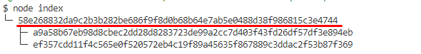

# GenerateMerkleRoot
This project is to build a MerkleTree for whitelist.

###### Update Whitelist
Update `whitelist.json` with your latest whitelist.

###### Build MerkleTree
Run the following script on command prompt.
``` node index ```


Before deploying the smart contract, run this project and set the value of `merkleroot` with the output MerkleRoot string.

